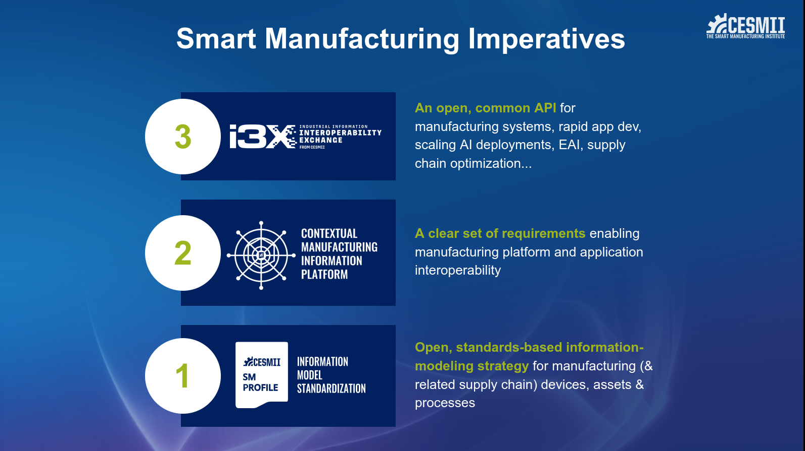

# CESMII at ProveIt 2026

At the ProveIt Conference, CESMII discussed the three Smart Manufacturing Imperatives and unveiled our solution to Imperative #3: the i3X API.

This repo contains the slides from that presentation, as well as sub-folders/modules for additional resources. This is preserved for posterity and is not updated.

For current information on the i3X effort, please visit [www.i3x.dev](https://www.i3x.dev) or the [i3X GitHub repo](https://www.github.com/cesmii/i3x).

For current information on CESMII, please visit [www.cesmii.org](https://www.cesmii.org).
